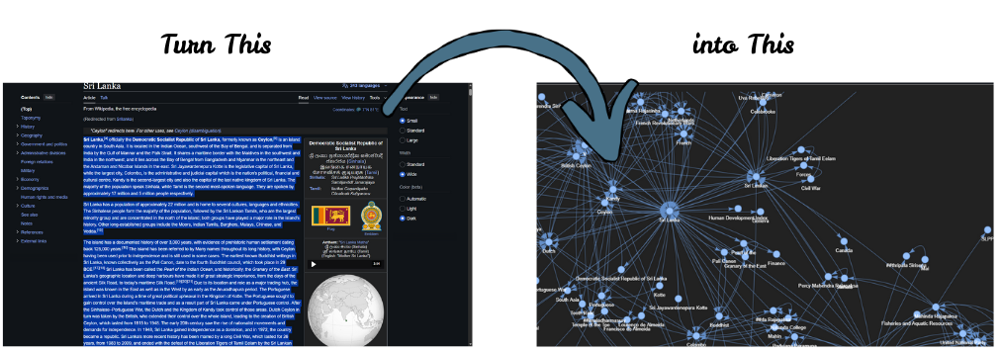
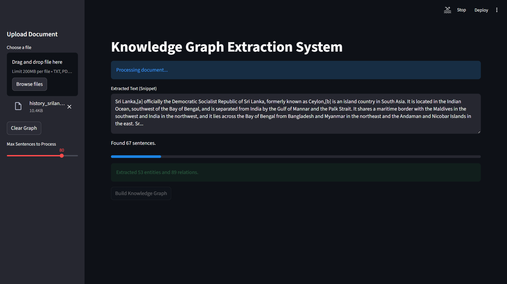

# knowledge-graph-NLP-pipeline



An end-to-end system that extracts entities and relationships from unstructured text (PDF, Text, HTML) and constructs an interactive Knowledge Graph in Neo4j.


## Features

### 1. Document Processing
Load and clean PDF, Text, and HTML files.


### 2. NLP Pipeline & Knowledge Graph
Automated graph construction using Named Entity Recognition (BERT) and Relationship Extraction.


### 3. Interactive Visualization
Explore the graph with zooming and panning capabilities.


- **Reasoning**: Basic graph analysis (Centrality) using NetworkX.
- **Visualization**: Interactive Streamlit dashboard with PyVis graph view.

## Prerequisites
- Python 3.8+
- [Neo4j Desktop](https://neo4j.com/download/) (running locally)

## Installation

1.  **Clone the repository**:
    ```bash
    git clone <repository-url>
    cd AntiGravity
    ```

2.  **Set up Virtual Environment**:
    ```bash
    python -m venv venv
    .\venv\Scripts\activate  # Windows
    # source venv/bin/activate  # Mac/Linux
    ```

3.  **Install Dependencies**:
    ```bash
    pip install -r requirements.txt
    python -m spacy download en_core_web_sm
    ```

4.  **Configure Environment**:
    Create a `.env` file with your Neo4j credentials:
    ```env
    NEO4J_URI=bolt://localhost:7687
    NEO4J_USER=neo4j
    NEO4J_PASSWORD=antigravity
    ```

## Usage

Run the Streamlit application:
```bash
streamlit run src/app/main.py
```
Upload a document, click "Build Knowledge Graph", and explore the results.

## Project Structure
- `src/document_processing`: Loaders and cleaners.
- `src/nlp`: NER and Relation Extraction models.
- `src/graph`: Neo4j interaction logic.
- `src/reasoning`: Graph analysis algorithms.
- `src/app`: Streamlit dashboard.

---
